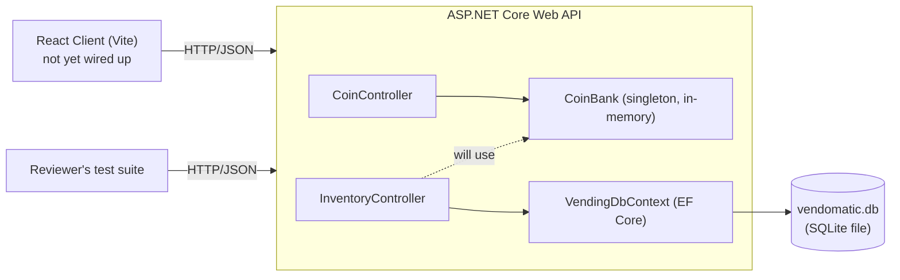
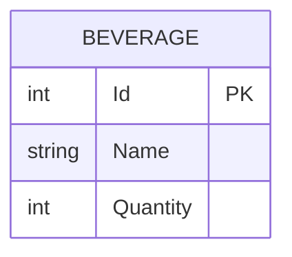

<!-- Last updated: 2026-07-04 -->
<!-- Last change: Resolved unanswered questions on Program.cs cleanup and Step 6 controller structure -->

# Vend-O-Matic - Technical Architecture

## System Overview

Vend-O-Matic is a small ASP.NET Core Web API fronting a SQLite database, with an optional React client that will simulate the physical machine. The API is the graded artifact: a reviewer's test suite talks to it directly over HTTP. The React client is a secondary, human-facing view over the same endpoints.

Two kinds of state exist, deliberately kept apart:
- **Durable inventory** (beverage quantities) lives in SQLite via EF Core.
- **Transient machine state** (coins currently inserted) lives in an in-memory singleton and is expected to reset on restart.

## Codebase Map

- **`Program.cs`** - app entry point and composition root. Registers controllers, the EF Core `DbContext` (SQLite), and `CoinBank` as a singleton. Still carries the leftover `WeatherForecast` record from the default template (harmless, unused, worth deleting during Step 12 cleanup).
- **`Controllers/`**
  - `CoinController.cs` - `PUT /` and `DELETE /`, the two coin-handling endpoints. Talks only to `CoinBank`.
  - `InventoryController.cs` - `GET /inventory`, `GET /inventory/:id`. Talks only to `VendingDbContext`. This is where Step 6's `PUT /inventory/:id` purchase logic will live, and it'll need to start talking to `CoinBank` too.
- **`Services/CoinBank.cs`** - the in-memory coin-count singleton (`AddCoin`, `GetHeldCount`, `Reset`). No persistence, resets to 0 on app restart by design.
- **`Models/Beverage.cs`** - the one persisted entity: `Id`, `Name`, `Quantity`.
- **`Models/DTOs/CoinRequestDTO.cs`** - request shape for `PUT /` (`{ "coin": 1 }`).
- **`Data/VendingDbContext.cs`** - the single `DbContext`. Seeds the 3 beverages via `HasData` in `OnModelCreating`.
- **`Migrations/`** - one migration (`InitialCreate`) that creates the `Beverages` table and inserts the 3 seed rows.
- **`appsettings.json`** - SQLite connection string (`Data Source=vendomatic.db`), pointing at a file-based DB in the project root.
- **`Vend-O-Matic.http`** - manual REST-client file for exercising the API by hand (Step 7 will expand this to cover every documented case).
- **`Vend-O-Matic.Tests/`** - xUnit test project. `VendingDbContextTests.cs` verifies seed data; `CoinBankTests.cs` verifies the coin singleton's behavior.
- **`client/`** - Vite + React scaffold, currently unmodified from `npm create vite`. `src/App.jsx` still renders the default Vite/React starter page; no fetch calls to the API exist yet. This is Steps 8-9 territory.
- **`dev-docs/`** - PRD, this architecture doc, ERD, roadmap, user stories, and wireframes.

## Entry Points

- **API startup:** `Program.cs` builds the `WebApplication`, wires DI (controllers, `VendingDbContext`, `CoinBank`), and calls `app.MapControllers()` so routing dispatches to `[ApiController]` classes by attribute route (`[Route("/")]` on `CoinController`, `[Route("inventory")]` on `InventoryController`).
- **Request lifecycle:** every request is `application/json` in and out (no views, no Razor). Controllers read the DB or `CoinBank` directly. There's no service layer between controllers and `CoinBank`/`DbContext`. That's an intentional simplicity choice for a project this size, not an oversight.
- **Client startup:** `npm run dev` in `client/` starts Vite. `main.jsx` mounts `App.jsx`. No API calls happen from the client yet.

## Component Breakdown

- **`CoinController`** - owns the two coin endpoints. Pure pass-through to `CoinBank`; no validation beyond model binding of `CoinRequestDTO`.
- **`InventoryController`** - owns inventory read endpoints today, and will own the purchase endpoint (Step 6). This is where `CoinBank` and `VendingDbContext` intersect: a purchase has to check/mutate both stores in the same request.
- **`CoinBank`** - single source of truth for "coins currently in the machine." Registered as a DI singleton, so the same instance is shared across every request for the process's lifetime. No thread-safety beyond .NET's default (a real hardware vending machine only takes one coin at a time anyway, so concurrent access wasn't a design concern here).
- **`VendingDbContext`** - single source of truth for beverage inventory. Standard EF Core DbContext, scoped per request via DI.

## Data Model

Persisted data is intentionally minimal: one table, no relationships. See [dev-docs/ERD.md](ERD.md) for the authoritative diagram and constraints (`Quantity` bounded 0-5, no restock path in v1). Reproduced here for convenience:

Machine coin state (`CoinBank`'s held-coin count) is explicitly **not** part of this schema. It's in-memory only, by design (see ERD notes and Roadmap Step 3).

## API Design

All endpoints exchange `application/json`. No auth (single anonymous machine, no concept of a user - see PRD's Stack Decisions).

| Method | Route | Status | Headers | Body | Notes |
|---|---|---|---|---|---|
| `PUT` | `/` | 204 | `X-Coins` (running total) | `{ "coin": 1 }` in | Implemented |
| `DELETE` | `/` | 204 | `X-Coins` (coins returned) | none | Implemented |
| `GET` | `/inventory` | 200 | none | array of quantities | Implemented |
| `GET` | `/inventory/:id` | 200 / 404 | none | quantity (int) | Implemented |
| `PUT` | `/inventory/:id` | 200 / 403 / 404 | `X-Coins`, `X-Inventory-Remaining` (success only) | `{ "quantity": 1 }` (success only) | **Not yet implemented - Step 6** |

The purchase endpoint's three-way branch (out of stock / insufficient coins / success) is specified in full in the PRD's Core Requirements section and Roadmap Step 6; this doc won't duplicate that table to avoid the two drifting out of sync.

## Infrastructure & Deployment

- Local-only. No CI/CD, no hosting, no environments beyond `Development`/default (see `appsettings.Development.json`). This matches the PRD's explicit out-of-scope note: the reviewer runs this on their own machine from the README.
- SQLite database is a single file (`vendomatic.db`) committed to `.gitignore` (not the repo), recreated via `dotnet ef database update` on a fresh clone.

## Key Technical Decisions

Summarized from the PRD's Stack Decisions section (full rationale lives there, not duplicated here):
- SQLite over Postgres: zero external DB setup for the reviewer.
- Controllers over minimal APIs: matches the Book 4 pattern this project is meant to practice.
- No auth: out of scope for a single anonymous machine.
- In-memory `CoinBank` instead of a persisted table: coin state is transient machine state, not durable inventory.
- No client router: the interaction is one linear flow, nothing to route between.

## Project Conventions

### Development Philosophy

Follows the developer's global philosophy (understand what you build, ask before guessing) with one project-specific addition: given the 3-day assessment window and fixed external spec, prefer the straightforward, spec-literal implementation over a more "clever" or abstracted one. A reviewer grading this against a fixed contract should be able to read the controller and see the spec, not a layer of indirection hiding it.

### Testing

- **Backend:** xUnit. Current coverage is narrow and intentional: `VendingDbContext` seed data and `CoinBank` behavior. Step 6's purchase logic should get equivalent unit-level coverage for its three branches before/alongside the manual `.http` verification in Step 7.
- **Frontend:** Vitest + React Testing Library, planned for Step 10, not yet started.
- **Manual/contract verification:** `Vend-O-Matic.http`, expanded in Step 7 to cover every documented request/response case against the PRD table.

### Code Style

- Controllers are thin: read/mutate `CoinBank` or `VendingDbContext` directly, no intermediate service layer. Confirmed for Step 6's purchase logic: the three-way branch stays inline in the `InventoryController` action rather than moving to a separate service class, matching the Book 4 pattern the rest of the controllers already follow. If the action gets cluttered, extract a private method within the controller first, not a new class, before revisiting this decision.
- DTOs live under `Models/DTOs/` for request/response shapes that don't map 1:1 to an entity (see `CoinRequestDTO`).

### Error Handling

- Not-found cases return ASP.NET Core's standard `NotFound()` / status codes, no custom error body shape defined yet. Step 6 will need to decide the exact body (if any) for the 403/404 purchase cases per the PRD table (headers carry the meaningful data; bodies are minimal/absent except on success).

### Commits & PRs

- Feature branches off `develop` (see this project's git workflow), merged via PR back to `develop`. `main` stays release-clean.

## Unanswered Questions

None currently open. (Resolved: `Program.cs` template cleanup deferred to Step 12; `InventoryController`'s Step 6 purchase logic stays inline per Code Style above.)
