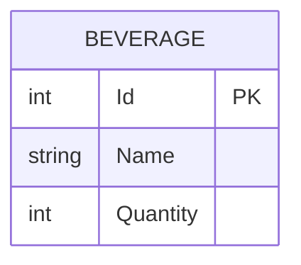

<!-- Last updated: 2026-07-03 -->
<!-- Last change: Initial ERD creation -->

# Vend-O-Matic - Entity Relationship Diagram

Generated from: dev-docs/PRD.md

## Diagram

## Notes

- **Scope: persisted data only.** This ERD models what lives in the SQLite database, not all application state. The machine's held-coin count is intentionally excluded: per Roadmap Step 3, it lives in an in-memory singleton (`CoinBank`) rather than the database, since it's transient machine state that resets on restart and doesn't need to survive a crash.
- **Single entity, no relationships.** `Beverage` is the only persisted entity. Nothing references it and it references nothing else, so there are no foreign keys or relationship lines to draw. That reflects the PRD's intentionally small scope (3 fixed beverages, no accounts, no order history), not a missing piece of the model.
- **`Quantity` constraints.** Per the PRD, `Quantity` starts at 5 for each seeded beverage and is decremented by 1 on a successful purchase. It should never go below 0 (an out-of-stock beverage stays at 0 rather than going negative) or above 5 (there's no restock endpoint in scope for v1).
